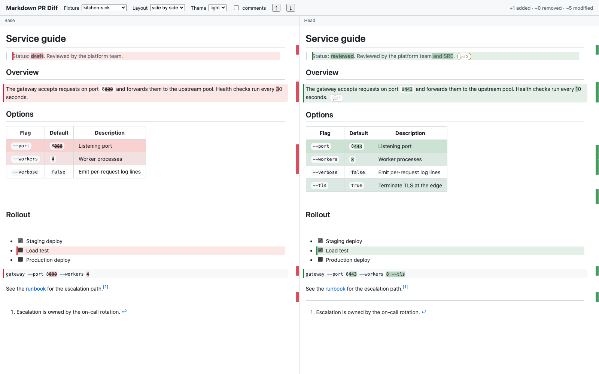

# Markdown PR Diff

A Chrome extension that gives markdown files in a GitHub pull request the diff
they deserve: both versions rendered side by side, changes highlighted down to
the word, review comments in place — and the pull request page left completely
untouched.



## Why

GitHub shows markdown changes as a diff of the raw text. Its built-in "rich
diff" renders the markdown but gives you one column, no word-level
highlighting, no synchronised scrolling, and nothing to navigate by. Reviewing
a document that way means reading syntax instead of reading the document.

## What it does

- **Side-by-side rendered diff** of the base and head versions, scrolling in
  lockstep, with the two sides aligned on the content they share.
- **Precise highlighting**: a changed table row highlights as a row, a changed
  list item as an item, and the differing words inside them are marked
  individually.
- **Unified layout** as an alternative, with the before and after of each
  changed block shown in sequence.
- **A reading view**: the file as it will look once merged, with no diff
  colouring at all — but still reviewable. Every block a comment can be
  anchored to is marked in the gutter, so what is available is visible
  without sweeping the pointer across the page.
- **Review comments in place** — existing threads appear under the paragraph,
  row or item they are about. Reply, start a new comment on any block, resolve,
  edit and delete, all without leaving the window.
- **A scrollbar minimap** and prev/next change navigation.
- **Light, dark and dimmed** themes, following whatever GitHub is set to.

### The page is not modified

The only thing this extension adds to GitHub's own markup is a single button in
each markdown file's header. It never hides the native diff, moves a node, or
touches React's DOM; everything it draws lives in a shadow root above the page,
and every piece of data comes from the GitHub API rather than being scraped out
of the markup. Close the window and the pull request is exactly as it was.

## Install

Not in the Chrome Web Store yet, so installation is Load unpacked either way.

### From a release

Take the zip from [the latest release][releases] and unpack it somewhere
permanent — Chrome reads the directory from disk on every start, so a folder in
Downloads that gets cleaned up takes the extension with it.

Then open `chrome://extensions`, turn on **Developer mode** (top right), press
**Load unpacked**, and select the unpacked directory — the one directly
containing `manifest.json`.

The zip itself cannot be dropped onto the extensions page; Chrome only accepts
a packed `.crx` that way, and these builds are not signed.

### From source

```bash
make install
make build
```

`make` on its own lists the targets. Everything is also available as an npm
script; `make` is only a discoverable front for them.

Then Load unpacked the **`dist/`** directory — not the repository root. `dist/`
is what the build assembles; the root is source, and the manifest deliberately
lives under `src/` so that pointing Chrome at the root fails plainly instead of
half-loading something.

### Either way

- Chrome will warn about extensions in developer mode on each startup. That is
  the price of an unpacked install, not a sign of a problem.
- Rebuilding updates the files but not the running extension: press the reload
  arrow on the extension's card, then reload any open pull request tab, since
  the old content script keeps running in tabs that were already open.
- The popup shows a build stamp. If behaviour disagrees with what a build
  should do, that stamp says which build is actually running.

[releases]: https://github.com/ainetx/markdown-pr-diff/releases/latest

## Connecting a GitHub account

Without an account the extension still renders diffs of anything your browser
session can already see, in read-only mode. Connecting one enables private
repositories and all comment actions.

Open the extension options and press **Connect GitHub**. A tab opens with the
authorization code already filled in; approve it and the tab closes by itself.
This is the OAuth device flow — no password, no client secret, no server.

The device flow needs an OAuth App to identify the extension by a client id.
This project's own is compiled in, so nothing has to be set up first — the id
is public by design and GitHub documents it as such.

If your organization enforces OAuth App access restrictions, a token from any
app it has not approved will not see the organization's private repositories.
The options page links to the approval request; the way around it is to paste a
personal access token with the `repo` scope instead, which needs no app at all.

### Using your own OAuth App

A fork, or anyone who would rather their reviewers authorized their app rather
than this one:

1. GitHub → Settings → Developer settings → **OAuth Apps** → New OAuth App
   (<https://github.com/settings/developers>).
2. Fill in a name and a homepage URL. The **Authorization callback URL** is a
   required field but the device flow never uses it — the repository URL will
   do.
3. Register, then on the app's page tick **Enable Device Flow** and update. It
   is off by default, and without it the flow fails at the first request.
4. The client id is on that same page, `Ov23li…`. Build with it:

```bash
make build GITHUB_CLIENT_ID=Ov23li...
```

On CI the same id comes from the repository variable `OAUTH_CLIENT_ID`.

For a GitHub Enterprise instance, add its hostname in the options (which asks
for permission for that origin) and register a separate OAuth App on that
instance.

## How the token is stored

The token is encrypted with AES-GCM before it touches disk, under a key that is
generated non-extractable — the key's bytes cannot be read back out, so copying
the browser profile or inspecting extension storage yields nothing usable. The
plaintext lives only inside the extension's background worker: it is never
handed to a content script, never included in a message, never logged.

It does **not** protect against code running with this extension's own
privileges, which can simply ask for a decryption. This is encryption at rest
and nothing stronger.

Disconnecting deletes the token locally; revoking the app's access itself is
done on GitHub, and the options page links straight to it.

## Known limitations

- Comments are posted individually, the equivalent of GitHub's "Add single
  comment". Batching them into a pending review with Approve / Request changes
  is not implemented yet.
- The comment editor is plain markdown with a preview. It has no `@` mention
  autocomplete, no suggestion blocks, and no file attachments.
- Mermaid and other GitHub-specific code-block renderers are shown as code.
- A raw HTML block inside markdown is rendered and sanitized, but if it is an
  unbalanced fragment it may not be classified as changed.
- Very large files are not rendered automatically; the size threshold is in the
  options.
- Reactions on comments are implemented in the API layer but not yet exposed in
  the overlay's UI.
- A new comment is anchored to the block it was started from, so a block
  spanning several lines produces a multi-line comment. Selecting a range
  across several blocks is not supported yet.
- The content script carries the renderer (~295 KB minified) and so loads on
  every github.com page, not only pull requests. Moving the overlay into an
  extension-page iframe would shrink it to a few kilobytes; it has not been
  needed so far.

## Development

```bash
make dev        # fixture playground — the whole engine, no GitHub needed
make test       # unit and property tests
make check      # typecheck, lint, test, build, verify dist/
make package    # zip for the Chrome Web Store
make clean
```

Build with the OAuth client id to enable the device flow:

```bash
make build GITHUB_CLIENT_ID=Ov23li...
```

The playground at `dev/` renders the fixture pairs in `test/fixtures/` through
the real engine, the real layouts and the real comment layer, with synthetic
threads. Its state is in the URL (`?fixture=…&layout=…&theme=…&comments=…`), so
any view can be linked to or screenshotted directly.

### Layout

```
src/core/      the diff engine: rendering, line mapping, classification,
               word diff, sanitization. Knows nothing about GitHub or the page.
src/background/ service worker: the only place the token exists. GitHub REST
               and GraphQL, the device flow, encrypted storage.
src/content/   the one thing injected into the page: a button.
src/overlay/   the window: layouts, threads, composer.
src/manifest.json
               the extension manifest, copied to dist/ at build time. It sits
               under src/ rather than the repository root so that pointing
               "Load unpacked" at the root fails plainly instead of loading a
               manifest whose files do not exist yet.
```

### Builds and releases

Every push to `main` and every pull request runs `make check` on CI and uploads
the built `dist/` as an artifact, so a tested build can be downloaded and loaded
unpacked without building it locally. Those builds are versioned
`<manifest version>.<run number>` — the run number only ever goes up, which is
what the Chrome Web Store requires of successive uploads.

A release is cut by pushing a tag:

```bash
git tag v1.0.0 && git push origin v1.0.0
```

The tag is the version. It is stamped into the manifest of the zip that the
release attaches, so the store listing and the repository cannot drift apart.
Locally the same stamping is available as `make version V=1.0.0`, which writes
`dist/manifest.json` and leaves the source manifest untouched.

CI reads the OAuth client id from the repository variable `OAUTH_CLIENT_ID`
(Settings → Secrets and variables → Actions → Variables). It is a variable
rather than a secret because the id is public by design — the device flow exists
precisely so that a client with no secret can obtain a token. The name cannot
start with `GITHUB_`; Actions reserves that prefix. Without the variable the
build still succeeds and the extension falls back to asking for a personal
access token.

Builds identify themselves: the popup, the overlay toolbar and the diagnostic
report all show a stamp, and on CI it carries the short commit sha. If a report
and a build disagree, the stamp settles which code was actually running.

## Credits

The diff engine began as [arjuntic/markdown-diff-visualiser][upstream], a VS
Code extension, used here under the MIT license. The pull-request DOM
integration follows [sabbour/md-review-extension][prior-art], also MIT. Full
attribution is in [NOTICE](NOTICE); license texts are in `vendor/licenses/`.

Three things were rewritten rather than ported, and the tests that pin them
down are the ones worth reading first:

- **Whole-document rendering.** Upstream rendered each changed run of lines as
  its own markdown fragment, which turned a changed table row into a paragraph
  and broke lists and fenced code. Here each version is rendered once, intact,
  and classification happens afterwards over the real DOM using markdown-it's
  source line map (`test/core/fixtures.test.ts` asserts that each side renders
  byte-identically to that document rendered alone).
- **Word diff over the DOM.** Upstream diffed escaped strings and matched them
  back to already-escaped HTML by character index, so any `&`, `<` or `"` made
  the match fail and highlighting silently disappear. Here the text nodes
  themselves are diffed and wrapped.
- **Sanitization.** Markdown from a pull request and bodies of comments are
  untrusted; everything goes through DOMPurify before it reaches the DOM.

## License

MIT — see [LICENSE](LICENSE).

[upstream]: https://github.com/arjuntic/markdown-diff-visualiser
[prior-art]: https://github.com/sabbour/md-review-extension
